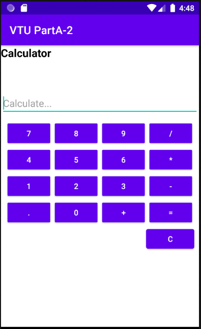

# MOBILE APPLICATION DEVELOPEMENT 

# Programme 2 (PartA-2)

Develop an Android application using controls like Button, TextView, EditText for designing a
calculator having basic functionality like Addition, Subtractic, Multiplication and Division.

